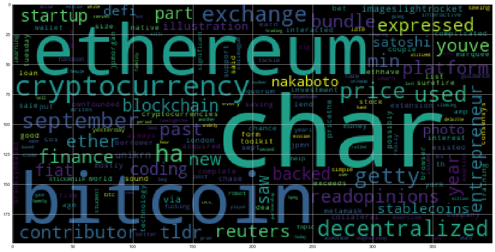

# Tales from the Crypto 
## Assessing Sentiment Score via NLP and Python

### Sentiment Analysis
1.  **Which coin had the highest mean positive score?** Bitcoin had a higher mean positive score at .078 to the .070 of Ethereum
2. **Which Coin had the highest negative score?** Ethereum had a higher negative score of .35, compared to that of Bitcoin at .29
3. **Which Coin had the highest positive score?** Bitcoin narrowly edged Ethereum in highest positive score with the two at .33 and .31 respectively.

